<!--
  Every panel below is a generated SVG that animates itself - see scripts/README.md
  to rebuild them. The heatmap refreshes daily through
  .github/workflows/update-profile-art.yml, so nothing here needs editing by hand.

  Each panel is one whole image at width 860. Do not split a panel into two
  images side by side: GitHub's profile README column is narrower than 860px on
  most screens, and separate images wrap onto different lines instead of scaling.
-->

  <a href="https://github.com/efekaravul/Applied-Data-Engineering-And-Machine-Learning"><code>portfolio</code></a> ·
  <a href="https://www.kaggle.com/code/efekaravul/sms-spam-multinomial-naive-bayes-practice"><code>sms-spam-detection</code></a> ·
  <a href="https://www.kaggle.com/code/efekaravul/diamond-price-svm-regression-practice"><code>diamond-price-regression</code></a> ·
  <a href="https://www.kaggle.com/code/efekaravul/iris-species-gaussian-naive-bayes"><code>iris-species-naive-bayes</code></a> ·
  <a href="https://www.kaggle.com/efekaravul"><code>kaggle</code></a> ·
  <a href="mailto:efekaravul@gmail.com"><code>email</code></a>

