<!--
  Every panel below is a generated SVG that animates itself - see scripts/README.md
  to rebuild them. The heatmap refreshes daily through
  .github/workflows/update-profile-art.yml, so nothing here needs editing by hand.
-->

  

